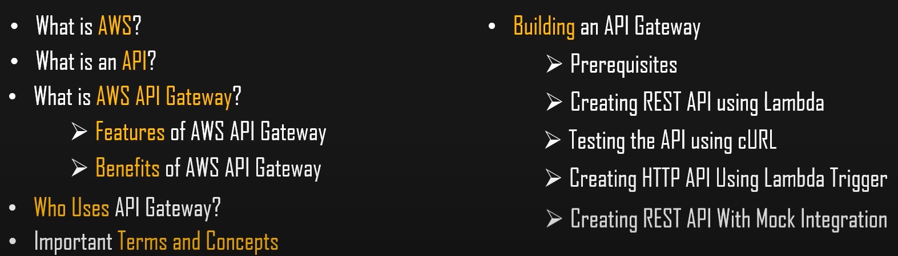
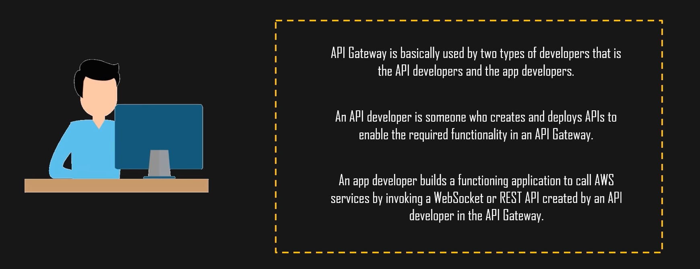
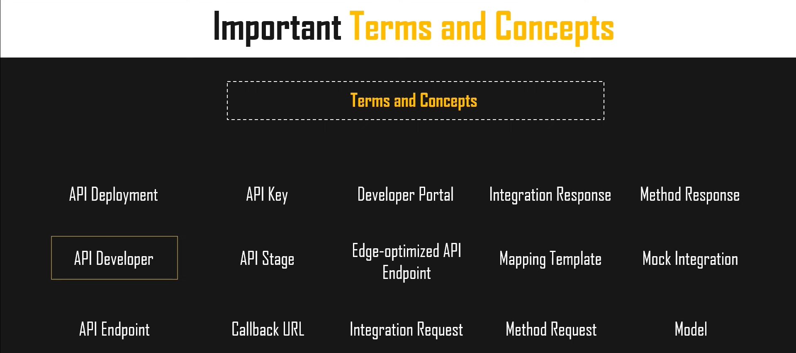

# AWS API GateWay

### What is API ?
API is the acronym for Application Programming Interface, Which is software intermediary that allows two application to talk to each other.

### What is AWS API Gateway ?
The Amazon API Gateway is a service provided by Amazon that is used to create,publish,maintain,monitor and Secure various API such as REST API,http and WebSocket at any scale.

###### REST API -> Representational State Transfer Application Programming Interface

### Feature 
1. Support stateful (WebSockets) and stateless (http and Rest) APIs.
2. Powerful flexible authentication mechanism
3. Developer portal . Canary release deployments, CloudTrail logging and monitoring of API usage and API changes
4. CloudWatch access logging and execution logging 
5. Ability to use AWS CloudFormation Templates to enable API creation
6. Supports for custom domain name
7. Integration with AWS WAF for protectiong your APIs against common web exploits
8. Integration with AWS X-Ray

### Benifits 
1. Provide sufficient API development by allowing you to run multiple versions of the same API simultaneously
2. Robust performance at any scale with very low latency
3. Cost saving with the tiered pricing model 
4. Easy to monitor the APIs using Amazon CloudWatch
5. Flexible security controls with the IAM and Cognito 
6. RESTful API can be created using both http APTs & REST APIs

### Important Concept of AWS RestAPI

  

### Who Uses API Gateway?

  

### Important Terms and Concepts

  

### API Gateway Pricing 
With AWS API Gateway , you only pay when your APIs are in use. There are minimum fees or upfront commitmens. For HTTP APIs and REST APIs , you pay only for the APIs calls you receive and the amount of data tranferred out.

###  Building an AWS API Gateway
###### Prerequisites
        1. IAM User with administrator permission

#### Creating REST API using Lambda
AWS Lambda is a serverless compute service. where developers don't have to worry about which aws resources to launch or manage them.Just they have to put code on lambda and lambda will execute your backend code by automatically launching the requred resources.

AWS -> IAM User with admin role -> Lambda Function -> create function -> (If function already their just delete and create new one) -> Author from scrach -> Function name -> runtime python -> Add permission(Default) ->create function(It will take few minute).

Lambda -> Test -> Configure Test -> If Any changes done just deploy and configure test -> Click Test 

Image

##### Next Choose API Gateway
createNewOne -> 

## AWS API Gateway
Amazon API Gateway is serverless and fully managed service that makes for developers to create , publish , maintain , and secure API at any scale 

  - Serverless and Fuly-Managed service
  - Support
    - RestFull API
    - WebSocket application
  - 1 million API calls received free per month within first year of free tier account 
  - Type Of API Available 
    - HTTP API 
    - WebSocket API 
    - REST API 
    - REST API Pro

#### Steps to AWS REST- API
1. create api
2. rest-api
3. new api
4. give name
5. regional
6. Create 

7. Create resources such as 'users'
8. Create a method type 'GET' 
9. Integration type is 'Lambda Function' 
10. Create 2 a Lambda function with below python code 
11. Using lambda function 1 ,2 
12. In API gateway select api you created , create resource  as dev with Get and Post. And Create One more resources with prod