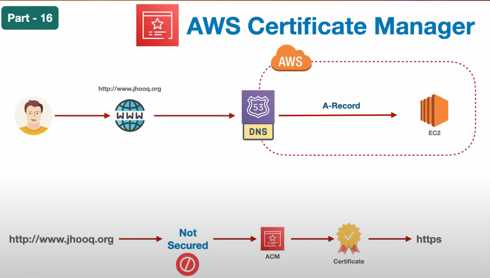
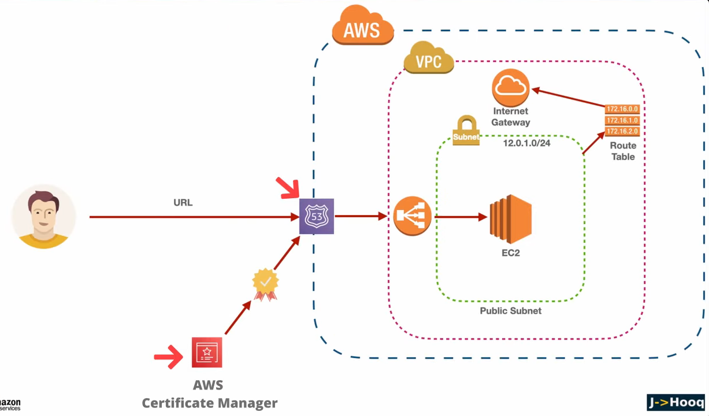
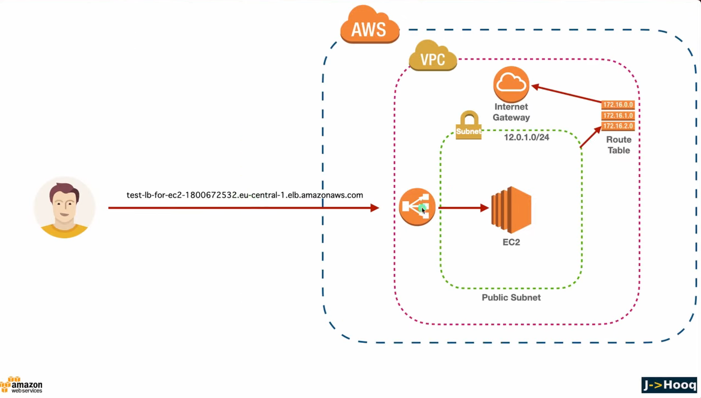
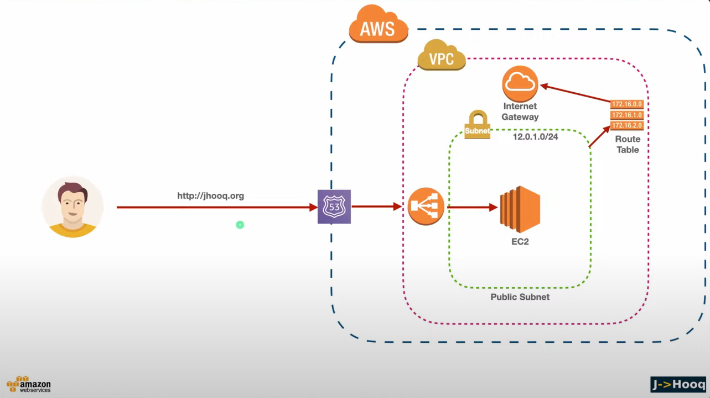
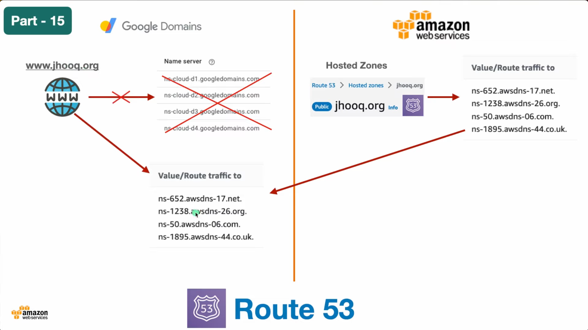
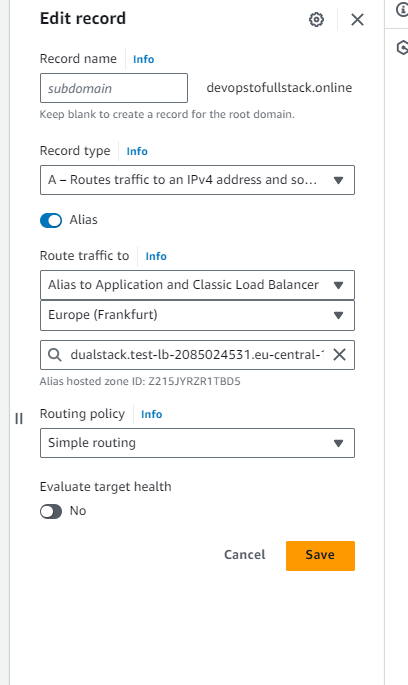
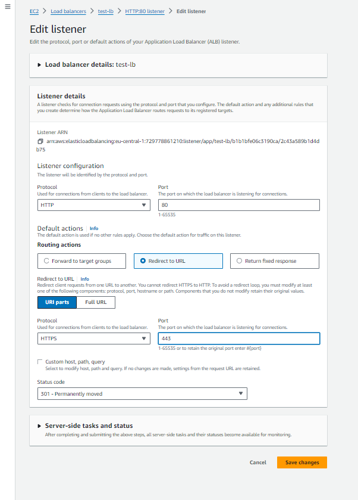
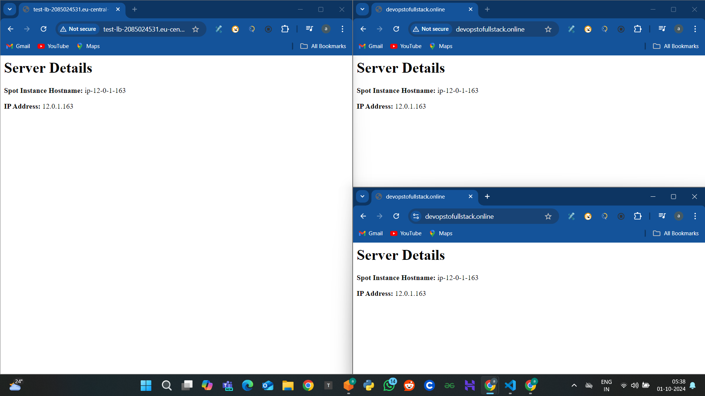
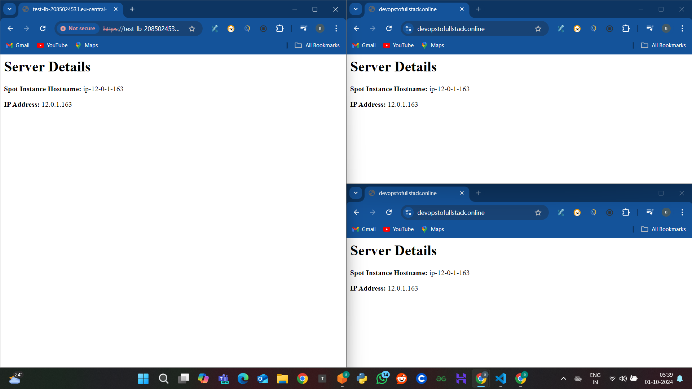

# AWS Certification Manager
<div align="center">
  
</div>

## Project OverView
<div align="center">
  
</div>

## Steps

1. Create Custom VPC     '12.0.0.0/16'
2. Create Subnet 1 public   '12.0.1.0/24'
3. Create Subnet  2  public subnet  '12.0.2.0/24'
4. Create a IGW
5. Create RT
6. Create Free Tier EC2 Ubuntu EC2 Instance in custom vpc
7. Add User Data
```
#!/bin/bash

sudo apt update -y
sudo apt install apache2 -y

sudo bash -c 'echo "<h1> Server Details</h1><p><strong>Spot Instance Hostname:</strong> $(hostname)</p><p><strong>IP Address:</strong> $(hostname -I | cut -d" " -f1)</p>" > /var/www/html/index.html'

sudo systemctl restart apache2
```
8. Create a TG
9. Create LB , 80,22,SG

#### Upto Here 
<div align="center">
  
</div>

10. Create Route53 setup Create A Record for your DNS And LB
Image upto here 
<div align="center">
  
</div>

### Name Server redirect in DNS
<div align="center">
  
</div>

### A record adding 
<div align="center">
  
</div>
11. AWS Certificate Manager
Goto -> Certificate Managet -> Request -> Give Domain Name -> DNS Validation -> RSA
After this create record this certificate to route53 , Step into certificate -> click on create a record on Route53. Now certifcate record is creted in Route53 CNAME.
Check for status of CM (Issue in CM)

12. Open the LB  and Add one more listener for https , and SG with 443
<div align="center">
  
</div>


### Result Comparison
<div align="center">
  
</div>

13. Redirect the http request to https 
Goto LB -> Select http listner -> edit as shown in image


<div align="center">
  
</div>

## &

<div align="center">
  
</div>