# Route53
<div align="center">
  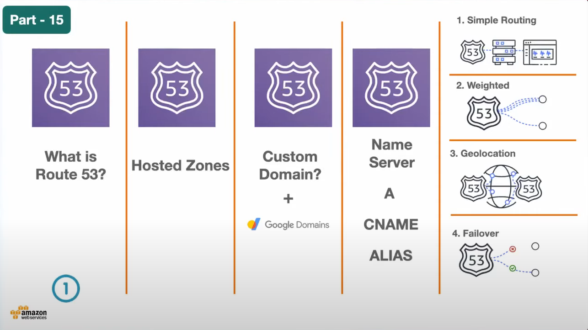
</div>

## Route53 services
<div align="center">
  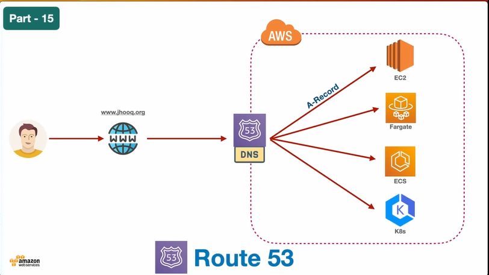
</div>

1. Setups Route53 hosted Zone
2. Cretate Hosted Zone with your domain name with public hosted zone and create
3. 'A' Record help in forwarding our request to the DNS
4. Point the NS record to your Domain
5. Do I own domain -> Yes (devopstofull.online)

## Name server configuration
<div align="center">
  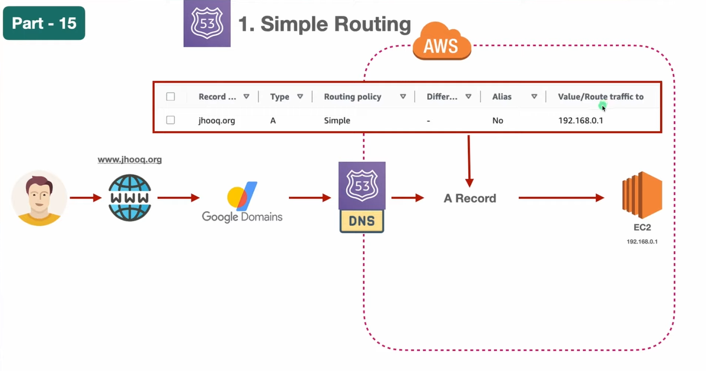
</div>

## First Demo 
<div align="center">
  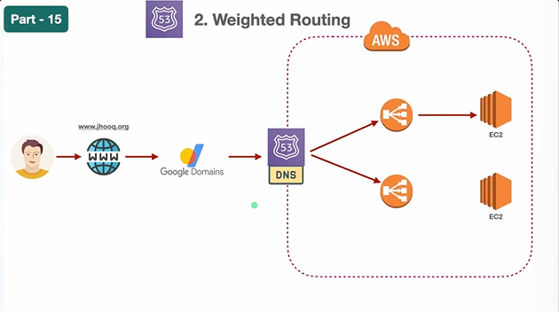
</div>

### Steps
1. Create EC2 Instance with ubuntu with user data
2. Keep NW setting to defualt 
3. Create the 'A' record with instance public IP in Route53 hosted zone

```
#!/bin/bash

sudo apt update -y
sudo apt install apache2 -y

sudo bash -c 'echo "<h1> Server Details</h1><p><strong>Spot Instance Hostname:</strong> $(hostname)</p><p><strong>IP Address:</strong> $(hostname -I | cut -d" " -f1)</p>" > /var/www/html/index.html'

sudo systemctl restart apache2
```

4. Enter your domain your IP address now pointing to a Domain Name Server and keep the TTL
<div align="center">
  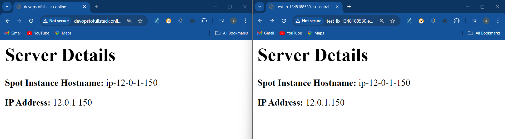
</div>


## SetUp LB
Problem with IP address is when we add the another instance it not possible to route53

##### WorkFlow with Weighted Route
<div align="center">
  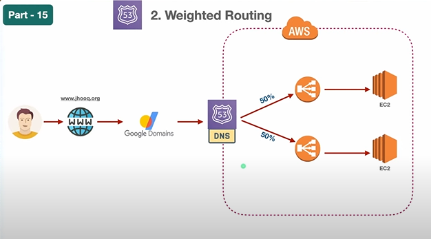
</div>

### Custom VPC minimal networking setting !!!
<div align="center">
  
</div>
1. SetUp Custom VPC for LB , 2 public & 1 private subnet

##. What we done 
<div align="center">
  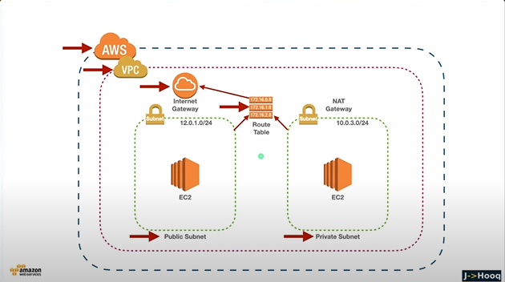
</div>

2. After this
Goto Route53 -> HostedZone -> Click Your HostedZone -> Create New Record for LB -> 'A Record' -> Choose EndPoint (Alias to classic application LB) -> Select region where LB created -> Choose LB -> Define Simple Record -> Create Record.

#### Result
<div align="center">
  
</div>

# Weighted Routing 
#### We defining the percentage to route traffic to the load balance 
<div align="center">
  
</div>

### Steps
1. SetUp another vpc and create EC2 instance within it , and Add user data with 
### 2nd Userdata
2. Create TG
3. Create LB
4. Route53 -> create a record with weighted option -> divide the vpc cidr to 50% 255 -> 128 + 128 , for different LB  -> create
<div align="center">
  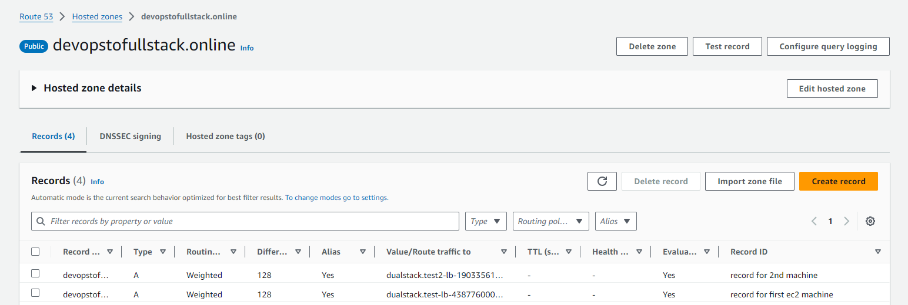
</div>

&

<div align="center">
  
</div>

& 

<div align="center">
  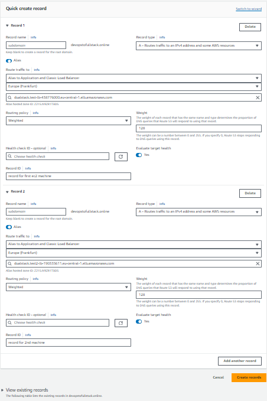
</div>

5. Now here Same domain is directing traffic to the two differrent LB,(In 2 different machine 2 diff application is running)

### Result
<div align="center">
  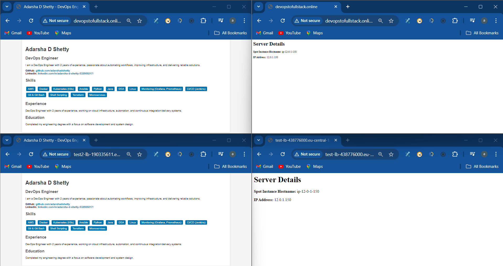
</div>


# Geolocation Routing  (Sweden & India) (India & Japan) I am using India and Japan 
<div align="center">
  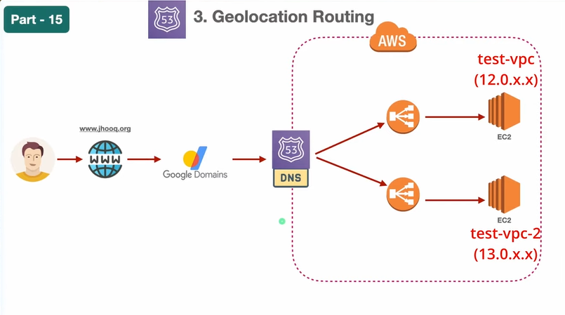
</div>

1. Keep everything same and just delete weighted record.
2. Create a new record with Geolocation Routing
3. Select Geolocation Routing 'A' record , everything is same just choose location , like from whicj location you want to accept the request.
4. I will connect the 1st EC2 machine to a Sweden and  2nd EC2 machine to Finland. 
5. I am using a NORD VPN first i will connect to Sweden and browse with my 'devopstofullstack.online'  Only connect first machine 
6. I am using a NORD VPN second i will connect to Finland and browse with my 'devopstofullstack.online' Only connect second machine 


#### Result

### 1nd Machine is Located in India , And I am Browsing from India 
<div align="center">
  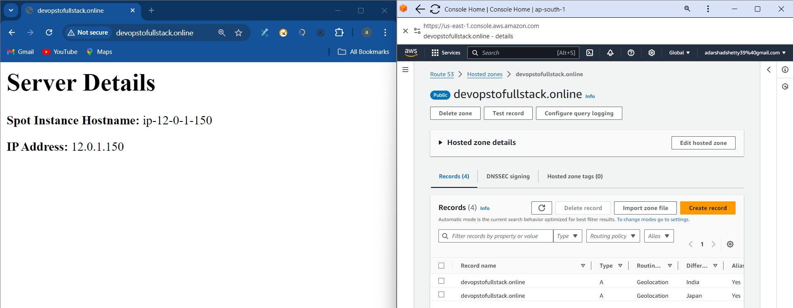
</div>

### 2nd Machine is Located in India , And I am Browsing from India 
<div align="center">
  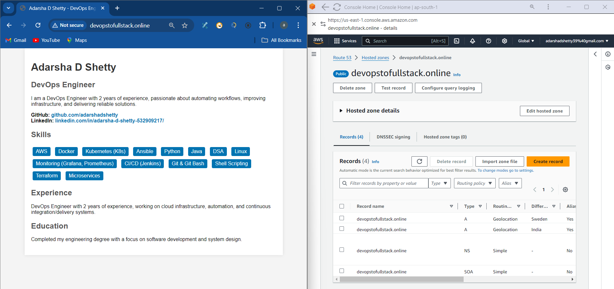
</div>

