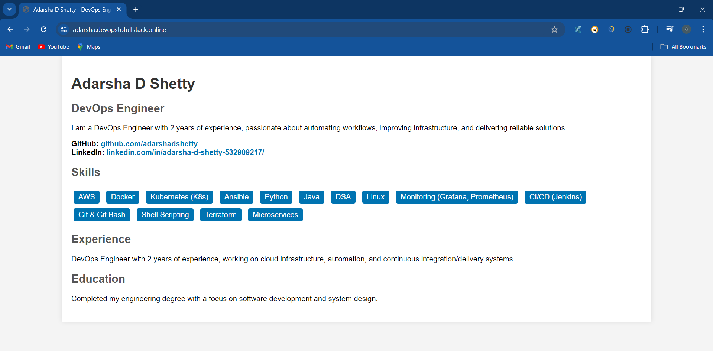
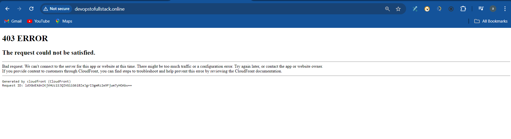

# Setup Static Website S3 Project

### Project Overview 

  

### Steps
1. Create S3 Bucket
2. Upload HTML file -> profile.html
3. Click On Cloud Front ->
4.  Create cloud distribution -> Choose Origin Domain (Loaction of s3 bucket) -> default -> choose Origin Access as (OACS) -> Create NEW OAC ->
5. Viewer keep protocol Redirect HTTP to HTTPS & GET,HEAD , Alternate domain name adarsha.devopstofullstack.online
6. Cache key and origin requests (Recommended)
7. Web Application Firewall (WAF) Enable
8. Use all edge locations (best performance)
9. Create or Request a new certificate and choose this (adarsha.devopstofullstack.online)
10. You will get one policy copy and paste that in a Bucket Policy.
11. Cloud Front -> Copy the domain name (https://d36ydyi7txoe8d.cloudfront.net/index.html) prefix with html file 
12. Bridge the domain and subdomain with route53. by creating 'A' record (IMAGE)

13. Create a A record in hostedzone with subdomain adarsha.devopstofull.online and value is cloudfront DNS (We are usually routing traffic to a CloudFront)

### AWS Certificate Manager 

  

### Result for -> https://d3rul6dzseb428.cloudfront.net/index.html , from CloudFront DNS 

  

### Result For -> https://adarsha.devopstofullstack.online/

  

### Error I am Faced , 

  

1. Add Alternate domain name this will solve the problem.