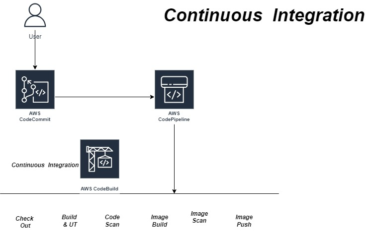
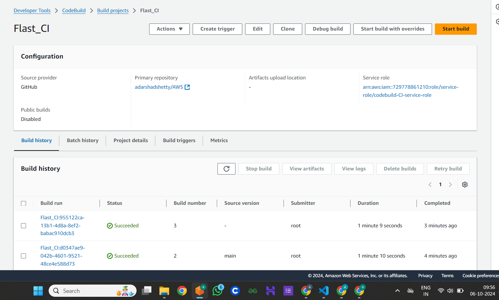
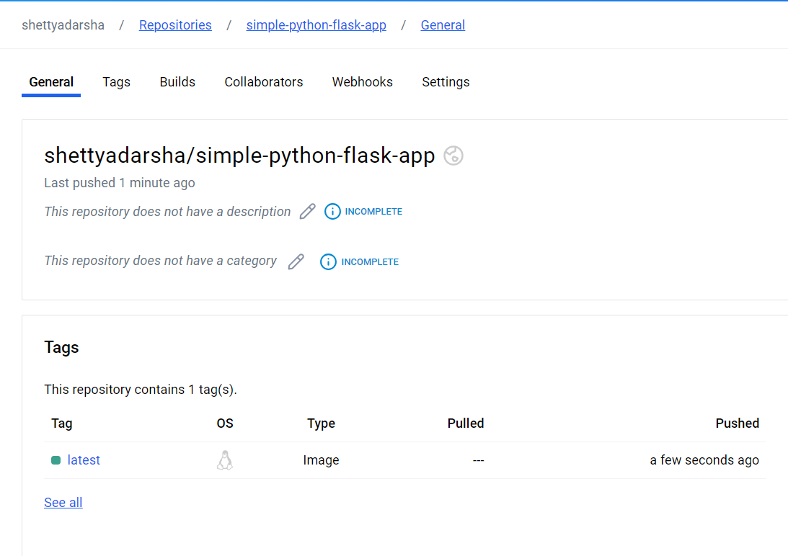
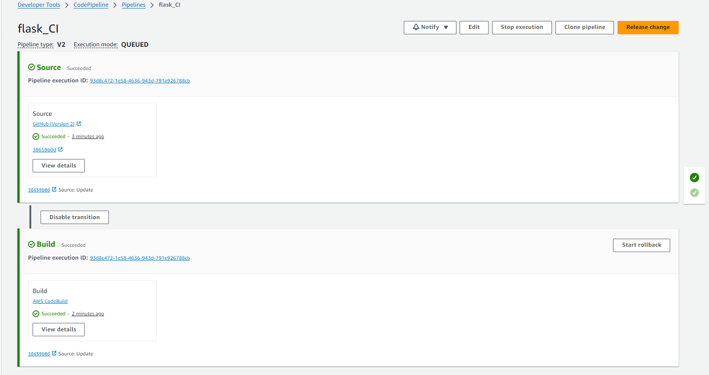

## AWS Code Pipeline Project CI
<div align="center">
  
</div>


#### Steps
1. We are using github as code repo here instead of AWS Code Commit
2. Code Stored in  https://github.com/adarshadshetty/AWS/tree/main/AWS_CODEPIPELINE/Project1_CI

3. Open the AWS Account Go to the AWS Code CodeBuild
4. Create a Project
5. Add source as GitHub
6. Connect your Github account using AWS Managed GitHub(If not You get Notification)
7. Repository in my github account
8. Choose the Repo where your code is stored
9. Provisioning mode 'On Demand'
8. Environment image 'Managed Image'
9. Compute 'EC2' -> Choose OS , Image etc...
10. Service Role -> 

11. Buildspec -> Switch to editor -> Write the pipeline script here 
12. 
```
  parameter-store:
    DOCKER_REGISTRY_USERNAME: /myapp/docker-credentials/username
    DOCKER_REGISTRY_PASSWORD: /myapp/docker-credentials/password
    DOCKER_REGISTRY_URL: /myapp/docker-registry/url
```

Configure the above credential in AWS System Manager
13. Open the AWS System Manager -> Open Parameter Store -> Create Parameter -> for docker , User Personnel access tocken for password , docker username , docker registry with docker.io

14. Pipeline script in buildspec.yaml

15. Create role with policy name 
    - AmazonSSMFullAccess
    - CodeBuildBasePolicy-CI-ap-south-1
    - CodeBuildCodeConnectionsSourceCredentialsPolicy-CI-ap-south-1

##### You will get success msg Docker image is created and Pushed to DockerHub

## Build Success
<div align="center">
  
</div>

## Docker Hub Image Pushed
<div align="center">
  
</div>

### Create a pipeline  , This is a steps when we do commit or changes in the project repo CI will invokes automatically.

#### Steps
1. Pipeline Name
2. Execution mode -> Queued (Pipeline type V2 required)
3. Service role
4. Next
5. Source provider -> GitHUb(Version 2)
6. Coonect To GitHub
7. Repository name
8. Default branch 'main'
9. Output artifact format -> CodePipeline default
10. Trigger type -> No Filter
11. Next 
12. Add build stage -> Other Build providers -> AWS CodeBuild ->Choose Project in this service
13. Build type -> Single Build
14. Deploy - optional -> Skip 
15. Create Pipeline

## Finally You Will get Success MSG like this 
<div align="center">
  
</div>