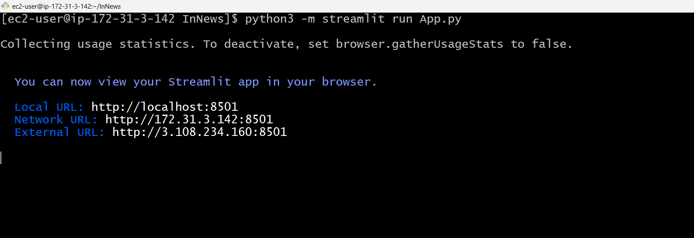
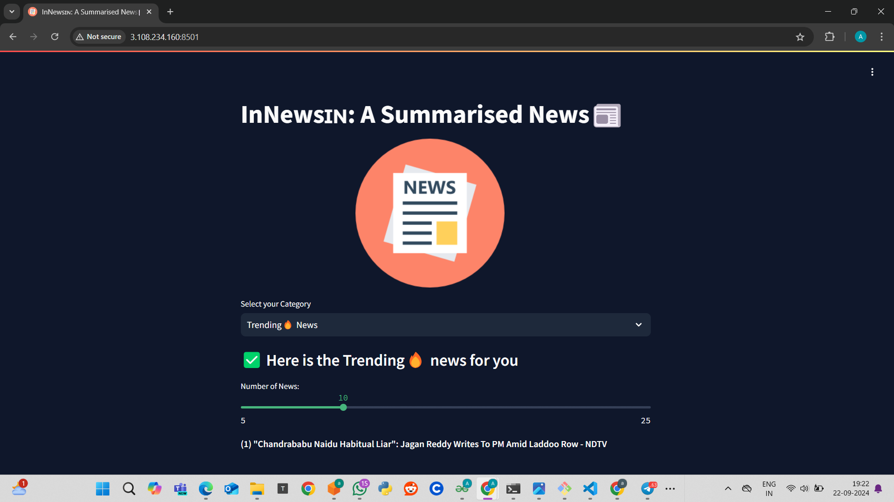

# Deploy Python Application on AWS EC2 

1. Launch EC2 Instances
2. Choose Amazon Linux with Free tier t2.micro in Mumbai Region.
3. Create a Key-Pair with .pem file
4. Enable 8501 port in Security Group
5. Add Elastic IP , Which does't change the IP address of EC2 instance .
6. Connect EC2 instance from the terminal with below command.

```
ssh -i "newaws.pem" ec2-user@PublicIPAddressOfYourInstance
```

```
sudo yum update -y
```

```
sudo yum upgrade -y
```

```
sudo yum install git -y
```

```
git clone https://github.com/Spidy20/InNews.git
```

#### Check python & pip available in EC2 machine
```
sudo yum install python -y
```

```
sudo yum install python3-pip -y
```

```
python3 -m pip
```

or 

```
pip install python-dateutil==2.8.2
```

## ReInstall Python
```
pip install --force-reinstall awscli
```


### Install all the requirement of the application
```
cd InNews/
```

### Install all the Dependencies.
```
python3 -m pip install -r requirements.txt
```

### Check the Application is Running
```
python3 -m streamlit run App.py
```
## If encounter ERROR
```
pip install lxml[html_clean]
pip install lxml_html_clean
```
After installation, restart your Python environment or script to make sure the new packages are properly imported.

### Click on External URL
<div align="center">
  
</div>

### Run your app continously
```
nohup python3 -m streamlit run App.py
```
### Give Running Process 
```
ps -ef
```

### Kill this Process
```
kill PID
```

## OutPut

<div align="center">
  
</div>