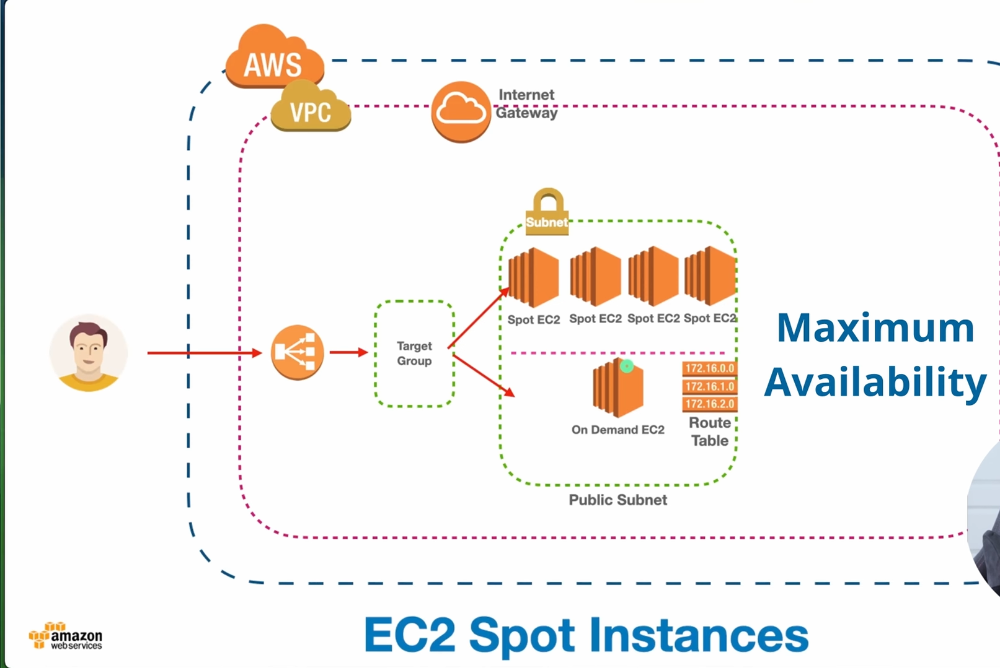
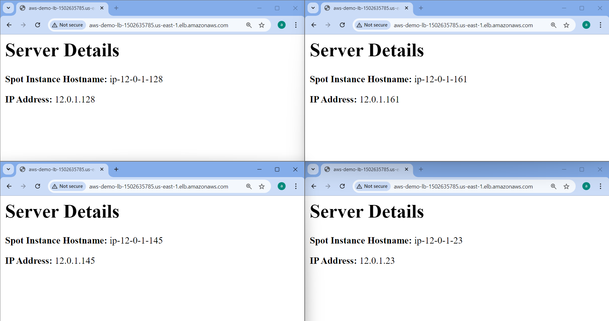

## EC2 Spot Instance
A spot instance is a type of virtual machine that uses unused computing power from a cloud service provider at a discount. Spot instances are a cost-effective option for applications that can be interrupted or have flexible start and end times
<div align="center">
  
</div>

1. Create custom VPC. 
2. Goto Spot Request
3. Click On Spot request -> Use launch Template -> 

```
#!/bin/bash

sudo apt update -y
sudo apt install apache2 -y

sudo bash -c 'echo "<h1> Server Details</h1><p><strong>Spot Instance Hostname:</strong> $(hostname)</p><p><strong>IP Address:</strong> $(hostname -I | cut -d" " -f1)</p>" > /var/www/html/index.html'

sudo systemctl restart apache2
```

## On Demand Ec2 Instance (For High Avalability)

You cannot delete or Stop the spot instances.

If you want stop just cancel the spot request. 

### Try to do as shown in Picture. WKT

## Steps 
Do all the in custom vpc
1. Create a Launch Template  with userdata
2. Create a spot instance request '4 instance' with custom vpc and sg 80, 22
3. Create 2 On-demand ec2 instance  
4. Create a TG and includes all 4+2= 6 ec2 instance
5. Create LB and add listener TG to this LB

## Now copy the LB DNS and enter in Chrome , You will get.

###### You can observe LB & TG & Spot request all working . Same DNS is sending request to all the Instances.
<div align="center">
  
</div>