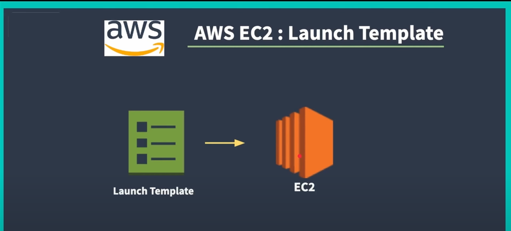
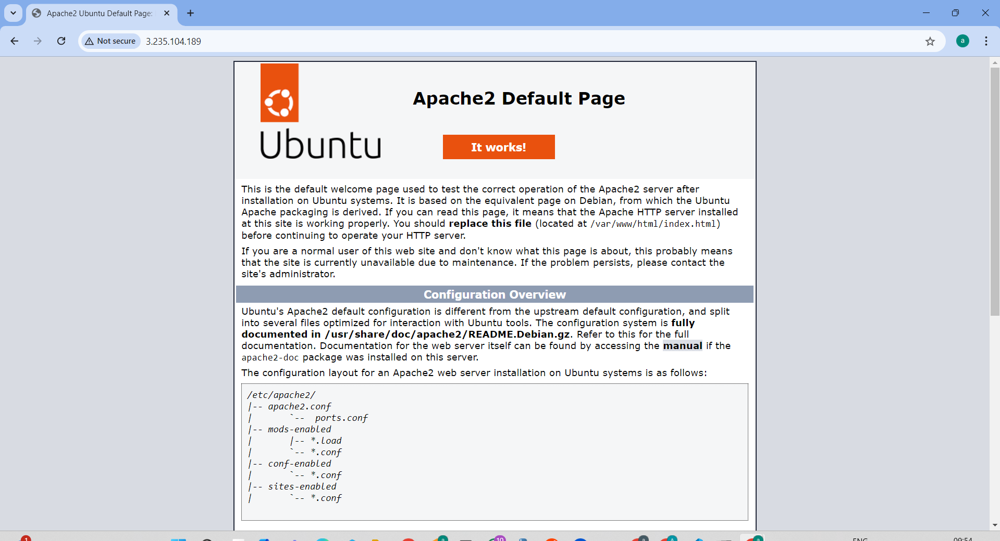

# EC2 launch Template is used to launch the EC2 Instances.

```
#!/bin/bash

# Update and install Apache2
sudo apt update -y
sudo apt install apache2 -y

# Write server details to the index.html
sudo bash -c 'echo "<h1> Server Details</h1><p><strong>Hostname:</strong> $(hostname)</p><p><strong>IP Address:</strong> $(hostname -I | cut -d" " -f1)</p>" > /var/www/html/index.html'

# Restart Apache2
sudo systemctl restart apache2

# Update and install Docker
sudo apt-get update -y
sudo apt-get install docker.io -y

# Add current user to the Docker group and adjust permissions
sudo usermod -aG docker $USER
sudo chmod 777 /var/run/docker.sock

```

### Create launch template from previous template "source template"

<div align="center">
  
</div>

<div align="center">
  
</div>
