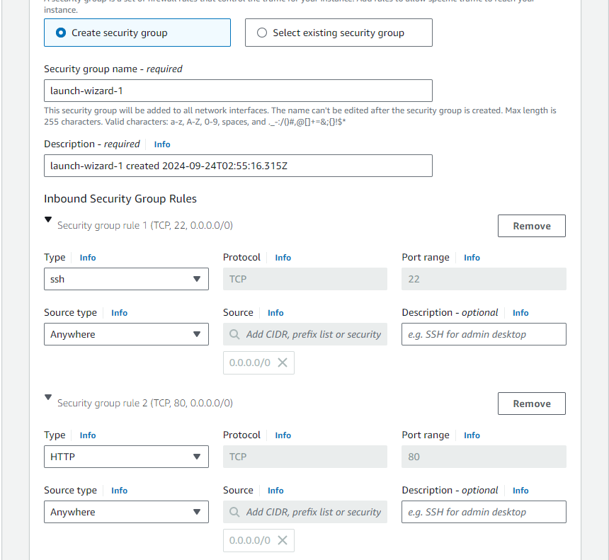
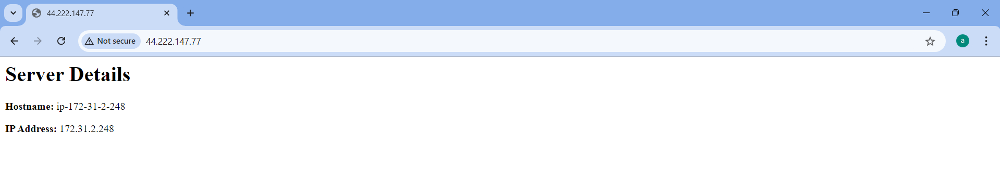

# Security Group is Inbound And Outbound

1. HTTP - 80 
2. SSH  - 22  to access the ec2 instance
3. ICMP     , User can ping the ec2 instance to check 

## Three Component
1. Source (Request is originating)(0.0.0.0/0 any one cam make request to the AWS EC2)
2. Protocol (TCP, HTTP, UDP , HTTPS, ICMP)
3. Port 

## Difference Between the SG / Firewall
SG exist b/w the aws resources.
Firewall is resposible for external traffic.

## Inbound SG
Validate the incoming traffic

## Outbound SG
Validate the outgoing traffic
"0.0.0.0/0" generally we set to this

### Create Ubuntu EC2 machine with this SG
<div align="center">
  
</div>

#### Let set up APACHE  in EC2 instance which will run on port 80.
```
#!/bin/bash
yes | sudo apt update
yes | sudo apt install apache2
sudo bash -c 'echo "<h1> Server Details</h1><p><strong>Hostname:</strong> $(hostname)</p><p><strong>IP Address:</strong> $(hostname -I | cut -d" " -f1)</p>" > /var/www/html/index.html'
sudo systemctl restart apache2
```

In Chrome "publicIP" no need to give port 80, port 80 is default SG.
### Script Output 
<div align="center">
  
</div>