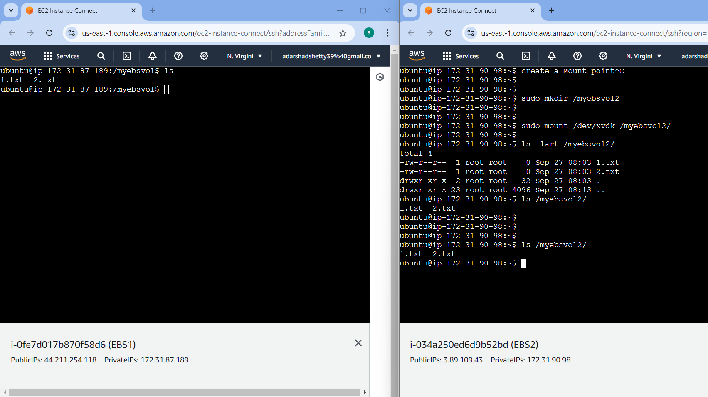

# EC2 EBS (Elastic Block Storage) Volume.
<div align="center">
  
</div>
### Create EBS Volume 

1. EBS volume is the additional space is attached to a EC2 instance
2. Type of EBS Volume 
    1. gp3
    2. gp2
    3. io2
    4. io1
Refer https://docs.aws.amazon.com/ebs/latest/userguide/ebs-volume-types.html

<div align="center">
  
</div>

<div align="center">
  
</div>

3. Create a EC2 instance in custom VPC ,  public subnet , IGW  (You can also use default)
4.  RUN 
```
lsblk
```
to check the volume.

5. Create EBS (In the same AZS as same region where ec2 present.)
GoTo -> EC2 -> EBS -> Volume -> Give name & volume in GB -> Create.
6. Attach this EBS to EC2 instance.
Goto EBSCreated -> Action-> Attach EC2 & device name choose dev-sdk. -> Attach.

7. Open EC2 & run 'lsblk'
8. To make it available 
   1. To check the disk partition
    ```
    sudo fdisk -l
    ```
    ```
    Disk /dev/xvdk: 100 GiB, 107374182400 bytes, 209715200 sectors
    Units: sectors of 1 * 512 = 512 bytes
    Sector size (logical/physical): 512 bytes / 512 bytes
    I/O size (minimum/optimal): 512 bytes / 512 bytes
    ```

<div align="center">

</div>

    2. TO check the file  system
    ```
    sudo file -s /dev/xvdk
    ```

    3. If the O/P is 'data' there is no file system for EBS volume that we created. For that we have to create a file system.
    4. To create file system
    ```
    sudo mkfs -t xfs /dev/xvdk
    ```
<div align="center">
  
</div>
    5. After this we have to mount this volume 
    ```
    sudo mkdir /myebsvol
    ```
    &

    ```
    sudo mount /dev/xvdk /myebsvol
    ```
<div align="center">

</div>

    & 
    ```
    ls -lart /myebsvol
    ```

    &
    ```
    df -h
    ```
<div align="center">

</div>

    #### Now we created EBS volume with 100GB but 98GB available.

### Increasing EBS Volume
EC2 -> EBS Volume -> Modify -> (It will take some time to increase)

You can increase the volume but you don't decreae the volume 

After in-use

```
sudo fdisk -l
```
You can  see the change 101GB


### Taking the Snapshot
Like we are reusing the EBS volume for another EC2 instance.

1. To switch to the  ebs 
```
cd /myebsvol
```
2. sudo touch 1.txt
3. sudo touch 2.txt

4. file1 file2 are written to that particular volume 

5. Create 2 ec2 instance 
6. Connect to the both


7. sudo fdisk -l 

8. Goto created EBS -> Action -> Create SnapShot -> Descript any -> Go and See the snapshot
9. Attach this snapshot to the ec2
Goto Snapshot -> create volume from snapshot ->  add tag -> create volume -> cpoy the ID -> find in EBS -> put Name -> (upto to here ebs volume is created from snapshot) ->
click on volumeID -> attach volume -> select 2nd EC2 instance -> attach volume 
10. 
```
sudo fdisk -l
```
<div align="center">

</div>
11. Repeat the command to varify the file system.
create mount for the file system .

12. In snapshot whatever content in the ebs is present befor createing ebs with ec2 , the older content copied to here.

<div align="center">
  
</div>