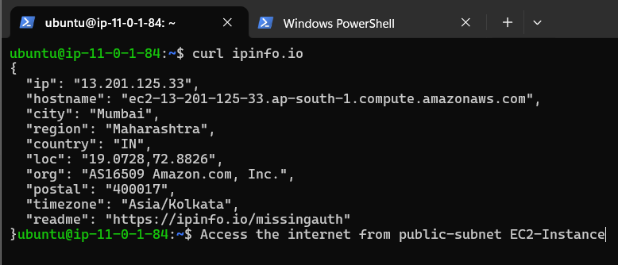

## Part-1 Ubuntu machine
1. Select region that nearest to you.
2. 2 type of key private key and public key. (.pem file this a private key)(RSA encrypted public and private key)
3. "0.0.0.0/0" means from anywhere.
4. Enable Auto-assign public IP (It gets you a public IP)
5. SSH into EC2-Instance
6. select t2.micro for learning purpose
```
Open an SSH client.

Locate your private key file. The key used to launch this instance is newaws.pem

Run this command, if necessary, to ensure your key is not publicly viewable.

chmod 400 "newaws.pem"  # we are making read only permision

Connect to your instance using its Public DNS:

ec2-13-127-103-49.ap-south-1.compute.amazonaws.com
```
Like 
```
ssh -i "newaws.pem" ubuntu@ec2-13-127-103-49.ap-south-1.compute.amazonaws.com
```

or 

```
ssh -i "newaws.pem" ubuntu@"Your EC2 Public IP"
```

## Part-2 
###### SetUp Window EC2 Instance
-> Amazon Machine Image (AMI)
-> Launching this one is same as Ubuntu just change the AMI
-> Private key only downloaded.
-> Allow RDP traffic from (like ssh for linux and ubuntu) (In real world we limit this IP Ranges)
-> defualt 30GB for windows.
1. Enable Remote Desktop on Your PC - Window
2. MocroSoft Remote Desktop         - MacOs
3. Remmina                          - Linux

For Windows 
1. Download the 'remote desktop file'
2. upload the file .pem  in password section. An give this password to the 'remote desktop file' username is 'Administrator'


## EC2 Instance SetUp In VPC
<div align="center">
  
</div>

1. VPC only
2. Name tag --> aws-demo-vpc
3. IPv4 CIDR manual input
4. IPv4 CIDR '11.0.0.0/16'  - "65,536" this is a total ip address.
<div align="center">
  
</div>

& 
 For  '11.0.0.0/32' - "1" this is total ip address.
 <div align="center">
  
</div>

5. Create VPC

CIDR range calculation --> 'google'  https://mxtoolbox.com/subnetcalculator.aspx  PLAY WITH THIS

6. Two Subnets
    1. Public Subnet  '11.0.1.0/24' "256" this is a total ip address.
    <div align="center">
    
    </div>

    <div align="center">
    
    </div>


    2. Private Subnet '11.0.2.0/24'  "256" this is a total ip address.
    <div align="center">
    
    </div>

    <div align="center">
    
    </div>

    ##### Created
    <div align="center">
    
    </div>

    3. Select two different AZs for two subnets.
IP ranges are which is less than the VPC for Subnets.

7. Internet Gateway (IGW)
Internet Gateway is a way to access the Internet.And these internet gateway is always associated with public subnet.Public Subnet is a subnet which is accessible via internet.
Accessing resources present in the public subnet.
    1. Create igw
    2. Attach VPC to this igw
##### Upto this internet access is given to public subnet only.
    3. After VPC attached create route table in subnets

8. Route Table.
   1. Go to Route Table
   2. aws-demo-public-rt - Name (public rt) for public-Subnet
   3. Select Your VPC
   4. aws-demo-private-rt  - Name (private rt) for private subnet
We create Route table  , that we route for igw and this route will give internet access to a public subnet.

###### Now associate these route table to a   public and private subnet.

9. subnet associations 
    1. Go to rt ->
    2. Subnet Association ->
    3. Explicit subnet associations ->
    4. Edit . & choose public subnet
 And same for private rt and choose private subnet. Association is Done

## Routing Internet
   1. Create Route in public-rt
   2. Click on route -> edit   -> add route
   3. Destination = '0.0.0.0/0' (Anyone from outeside with internet can access this resoureces.)
   4. Target = IG (that we are created)
   5. save changes

10. NAT Gateway (Not Free Charges)
   1. This GateWay for private subnet
   2. IG provide 2 way access (2 way communication)
   3. NAT  is opposite only one way communication
   4. Any Resources present in private subnet can make a request to outside through NAT
   5. This NAT is necessary for RDS , database server deployed
   
   6. Go to NAT Gateway -> Create NAT Gateway -> attach public-subnet -> Allocate ElasticIP -> create
    <div align="center">
    
    </div>

11. Create route for private table so that they can use NAT 
   1. Create Route in private-rt
   2. Click on route -> edit   -> add route
   3. Destination = '0.0.0.0/0' (Anyone from outeside with internet can access this resoureces.)
   4. Target = NAT (that we are created)
   5. save changes

###        Upto here networking is done 

12. Now create a EC2 instance in public and private subnet.
    1. EC2 instance in Public subnet
    2. Attach vpc that you created
    3. Attach public-subnet
    4. Auto-assign public IP 'enable'
    5. create sg [22-ssh , All-ICMP-IPv4 - for ping]
    6. create  


    1. EC2 instance in private subnet
    2. Attach vpc that you created
    3. Attach private-subnet
    4. Auto-assign public IP 'disable'
    5. create sg [22-ssh , All-ICMP-IPv4 - for ping -> range is public subnet range '11.0.1.0/24']
    6. create 

13. SSH into a public and private subnet EC2 instance.
    1. Public EC2-Instance
    ```
    ssh -i "newaws.pem" ubuntu@13.201.125.33
    ```
     #### Request from outside accessible
    <div align="center">
    
    </div>
    
    #### Request from inside accessible
    <div align="center">
    
    </div>

    2. Private EC2-Instance

    -> SSH from outside is not possible. You can ssh from public subnet.

    #### Request from not outside accessible
    <div align="center">
    
    </div>
    
    #### Request from inside accessible
    <div align="center">
    
    </div>

    #### How to ssh into a private EC2 machine
    <div align="center">
    
    </div>

    Here key is .pem file that is used to public ec2 machine

    #### Private EC2 machine accessed from Public EC2
    <div align="center">
    
    </div>

    #### Request is Going Out From Private EC2 machine
    <div align="center">
    
    </div>


## EC2 User Data Script 
<div align="center">

</div>

Why it is needed ? 
It will run when boot tome


##### For linux
```
#!/bin/bash

#install apache
sudo yum install -y httpd

#enable and start apache
sudo systemctl enable httpd
sudo systemctl start httpd

#navigate to the html folder that apache creates on install
cd /var/www/html

sudo mkdir Css
sudo mkdir Scripts

#create index.html file and change file permissions
touch index.html
sudo chmod 775 index.html

sudo echo '<html> <body> <h1> Hello! Apache server successfully started! </h1> </body> </html>' > index.html
```

##### Check the log
```
tail -3000 /var/log/cloud-init-output.log
```

Allow HTTP & HTTPS Request

### Result 
<div align="center">

</div>
