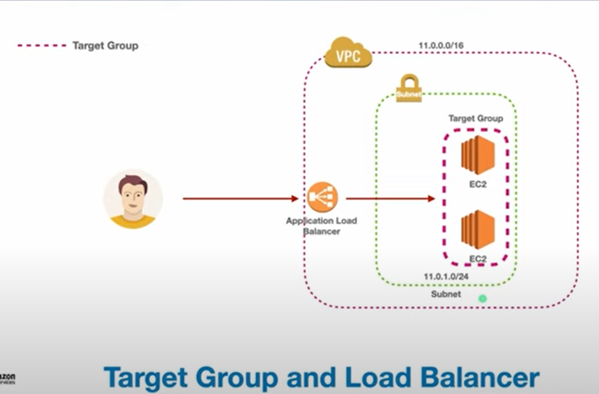
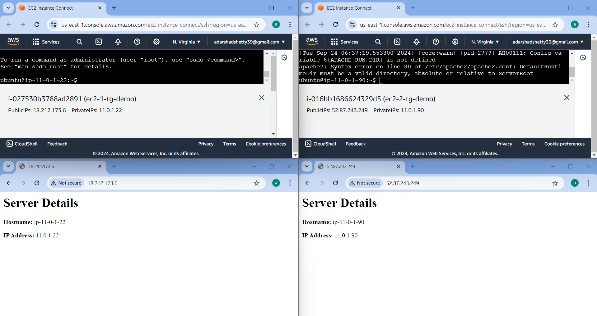
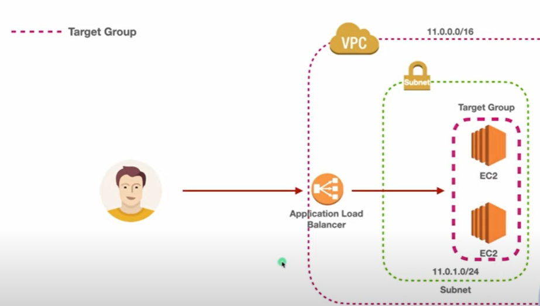
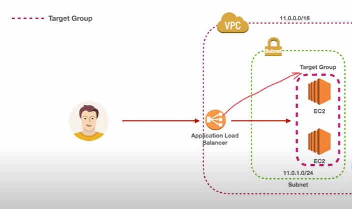
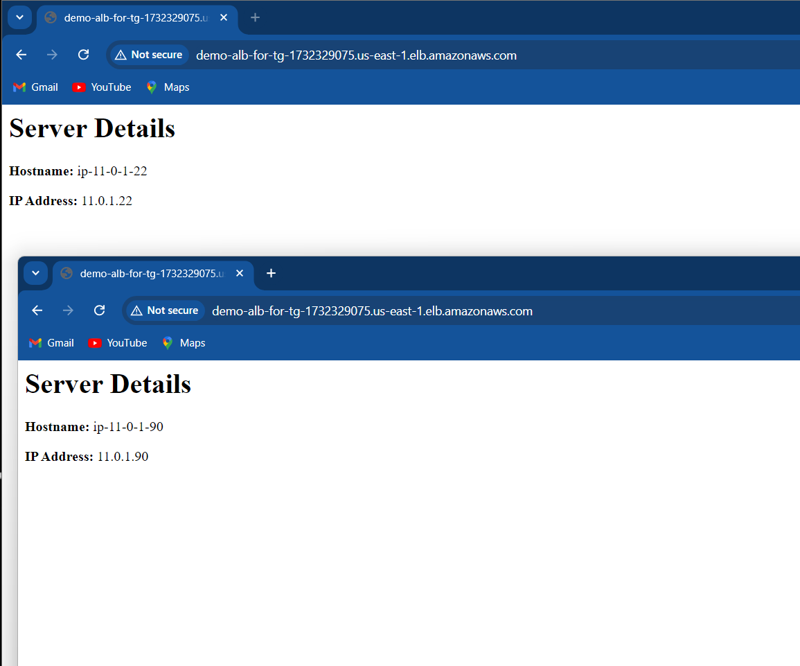
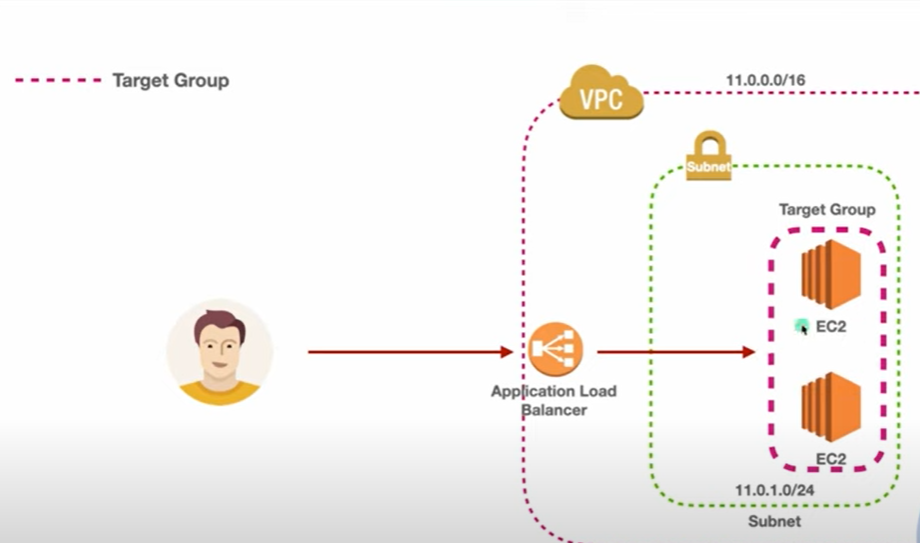

## EC2 Application Load Balancer & Target Group.

<div align="center">
  
</div>

TG can contain may be more than one resources.

ALB -> It will forward the request to the target group and TG forward that request based on the port and protocol.

Through the listener request is forwarded to the ALB to TG.

### Working 

RequestFromUser --> ALB --> through( checklistners) --> TG --> Check(port,protocol) (if correct) --> Resources.

# DEMO
1. Create 2 EC2 Instance with ubuntu OS in freetier in your VPC , subnet, rt, igw,
2. Add the below userdata script


user-data
```
#!/bin/bash
sudo apt update -y
sudo apt install apache2 -y
sudo bash -c 'echo "<h1> Server Details</h1><p><strong>Hostname:</strong> $(hostname)</p><p><strong>IP Address:</strong> $(hostname -I | cut -d" " -f1)</p>" > /var/www/html/index.html'
sudo systemctl restart apache2
```
3. Verify the Apache Server is Runnig in Both the server.
<div align="center">
  
</div>

4. Now create a TG and include the 2 ec2-instances in that TG 
<div align="center">
  
</div>

GoTo TG -> Intanse -> name -> protocol (http 80) -> VPC(Custom) -> Next ->include both the instance -> click on 'include as pending below'  -> create TG. After couple of minute status will healthy. --> The Unused status will change when we create LB.


5. Load Balancer(LB)

Create LB -> ALB -> NAME -> InternetFacing -> IPv4 -> VPC(Cu) -> both AZS -> SG ( http) -> Listeners and routing (TG cu) -> create.

### Listeners Why ?
<div align="center">
  
</div>

Wait for ALB to change the status from 'provisioning' tp 'active' state. 

After Active Check the TG , both instance status is in 'healthy'

To varify the request is going from LB to EC2 instance copy paste DNS of LB in chrome
```
demo-ALB-for-tg-1732329075.us-east-1.elb.amazonaws.com
```
#### ALB is routing traffic to the both server.
<div align="center">
  
</div>

#### What we done , this one
<div align="center">
  
</div>